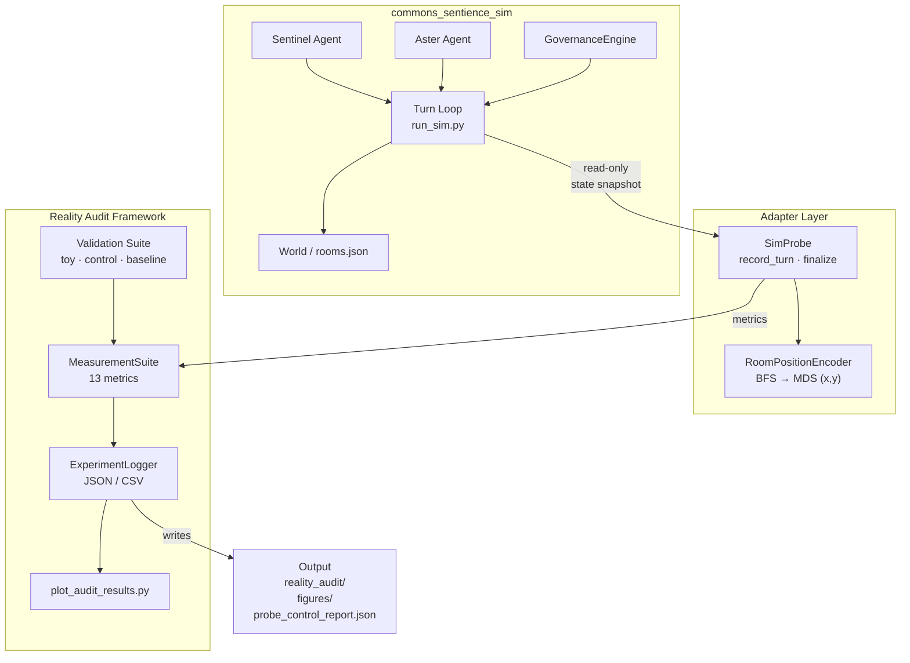

# Architecture Overview

## System map

The project has three layers: the original **sandbox**, the **Reality Audit
framework** (physics-based metric engine), and the **adapter layer** that
bridges them.

---

## Text diagram

```
┌─────────────────────────────────────────────────────────────────┐
│                   commons_sentience_sim                          │
│                                                                  │
│  ┌─────────┐   ┌─────────┐     ┌───────────────────────────┐   │
│  │ Sentinel│   │  Aster  │     │  GovernanceEngine          │   │
│  │  Agent  │   │  Agent  │     │  (rules.json)              │   │
│  └────┬────┘   └────┬────┘     └───────────┬───────────────┘   │
│       │             │                       │ permits/blocks     │
│       └──────┬──────┘                       │                   │
│              ▼                              │                   │
│     ┌────────────────┐    actions           │                   │
│     │   World        │◄─────────────────────┘                   │
│     │ (rooms.json)   │                                          │
│     │ 5 rooms, graph │                                          │
│     └────────┬───────┘                                          │
│              │  per-turn state (room, affective, trust, action) │
│              ▼                                                   │
│     ┌──────────────────────────────────────────────────────┐   │
│     │               Turn Loop  (run_sim.py)                 │   │
│     │  for turn in range(total_turns):                      │   │
│     │    agents move → observe → act → governance check     │   │
│     │    record state snapshots                             │   │
│     │    ── step 10.7 ──────────────────────────────────── │   │
│     │    if _audit_probe: _audit_probe.record_turn(...)     │   │  ← insertion point
│     └──────────────────────────────────────────────────────┘   │
└─────────────────────────────────────────────────────────────────┘
                              │
                              │ read-only state snapshot
                              ▼
┌─────────────────────────────────────────────────────────────────┐
│                    Adapter Layer                                  │
│                                                                  │
│  ┌──────────────────────────────────────────────┐               │
│  │  SimProbe  (reality_audit/adapters/sim_probe) │               │
│  │  • probe_mode: passive | active_measurement   │               │
│  │  • record_turn() — stores per-agent snapshot  │               │
│  │  • finalize()   — computes metrics + writes   │               │
│  └────────────────────┬─────────────────────────┘               │
│                       │ encode(room_name) → (x, y)              │
│                       ▼                                         │
│  ┌────────────────────────────────────────────┐                 │
│  │  RoomPositionEncoder                        │                 │
│  │  (reality_audit/adapters/room_distance.py)  │                 │
│  │  • BFS shortest-path distances              │                 │
│  │  • Classical MDS → stable (x, y) in [-1,1]² │                │
│  └────────────────────────────────────────────┘                 │
└─────────────────────────────────────────────────────────────────┘
                              │
                              │ metric computation
                              ▼
┌─────────────────────────────────────────────────────────────────┐
│                   Reality Audit Framework                         │
│  ┌─────────────────┐  ┌──────────────────┐  ┌───────────────┐  │
│  │  RealityWorld   │  │  MeasurementSuite │  │ ExperimentLogger│ │
│  │  (world.py)     │  │  (measurement.py) │  │ (logger.py)   │  │
│  │  6 WorldModes   │  │  13 static metrics│  │ JSON/CSV out  │  │
│  └─────────────────┘  └──────────────────┘  └───────────────┘  │
│  ┌──────────────────────────┐  ┌────────────────────────────┐  │
│  │  ExperimentRunner        │  │  Validation Suite           │  │
│  │  (experiment.py)         │  │  (validation/)              │  │
│  │  config-driven episodes  │  │  toy_experiments.py         │  │
│  └──────────────────────────┘  │  control_experiments.py     │  │
│                                 │  baseline_agents.py         │  │
│                                 └────────────────────────────┘  │
└─────────────────────────────────────────────────────────────────┘
                              │
                              │ writes
                              ▼
┌─────────────────────────────────────────────────────────────────┐
│                   Output Artifacts                                │
│                                                                  │
│  commons_sentience_sim/output/                                   │
│  ├── reality_audit/                                              │
│  │   ├── config.json          (probe configuration + room map)  │
│  │   ├── raw_log.json         (per-agent-turn records)          │
│  │   ├── raw_log.csv          (same, tabular)                   │
│  │   ├── summary.json         (aggregated metrics)              │
│  │   └── figures/             (plots, if generated)             │
│  └── probe_control_report.json  (read-only verification)        │
└─────────────────────────────────────────────────────────────────┘
```

---

## Mermaid diagram



---

## Key design decisions

| Decision | Rationale |
|---|---|
| Read-only probe | Any mutation of sandbox state by the measurement layer would invalidate conclusions. The probe is explicitly forbidden from modifying any agent or world object. |
| MDS room embedding | The audit framework was built for continuous 2-D worlds. MDS provides a principled, topology-preserving mapping from the discrete room graph into continuous coordinates. |
| Three probe modes | `inactive` (no-op), `passive` (production default, always read-only), `active_measurement_model` (experimental — simulates sparse audit bandwidth without touching the sandbox). |
| Adapter pattern | Keeping the bridge code in `reality_audit/adapters/` means the core audit framework remains independent of the sandbox and can be reused with other simulations. |
