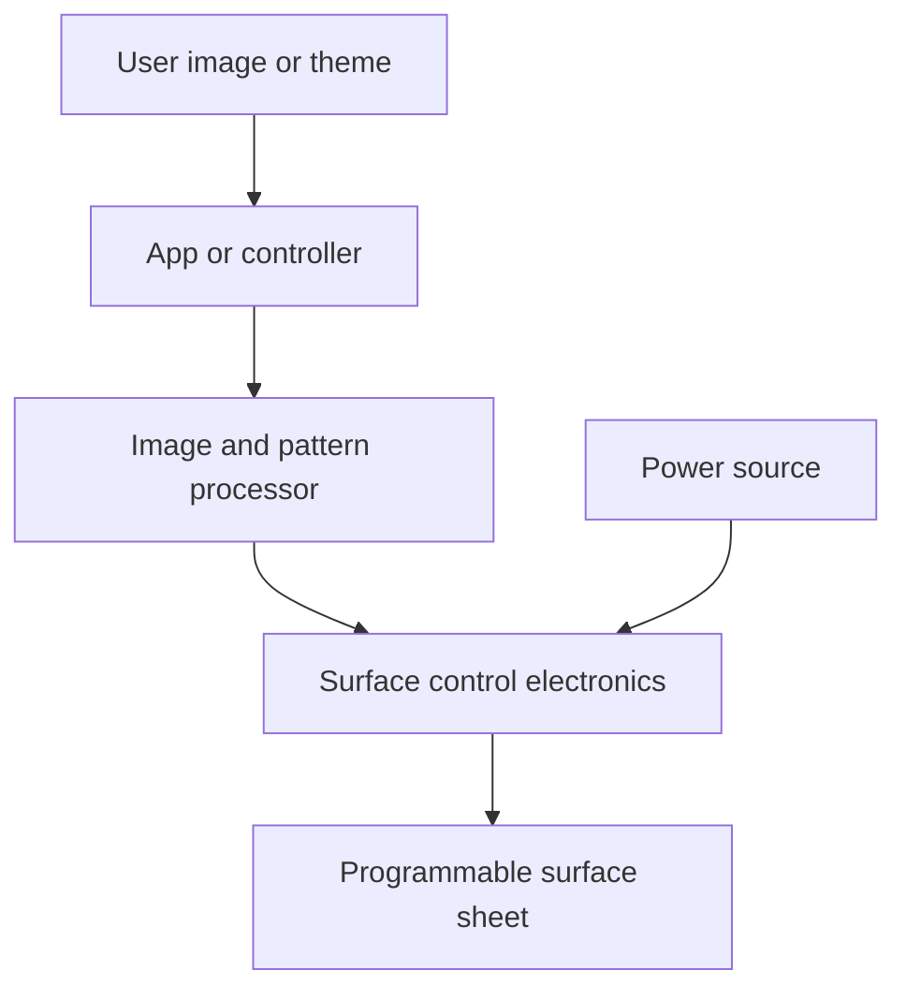

# ChromaSkin / ChromaMask Programmable Surface Paper Prototype

## Status

This document is a paper prototype and product-architecture draft. It does not claim that ChromaSkin has been physically built, safety-certified, weather-tested, mass-produced, or validated as a finished product.

The purpose is to make the idea concrete enough for engineering review, market review, materials review, student capstone routing, maker-space discussion, and staged prototyping.

## Plain-English Concept

ChromaSkin is a programmable visual surface platform: a cut-to-size sheet, panel, wrap, or tile that can be applied to objects and then changed digitally.

A simple phrase for reviewers:

> Programmable construction paper for objects, rooms, displays, furniture, and vehicles.

Instead of repainting, replacing, rewrapping, or buying a new object, the user changes the visible surface through an app, controller, or programmed theme.

## Product Names

| Name | Working meaning |
|---|---|
| ChromaSkin | Larger surfaces such as furniture, walls, vehicles, display panels, retail fixtures, and interior design surfaces. |
| ChromaMask | Smaller object skins such as phone cases, remotes, controllers, laptops, desk tiles, nameplates, product shells, and decor pieces. |

These names are working product names only. Trademark review is required before commercial use.

## Core Use Cases

| Use case | Example | Why it matters |
|---|---|---|
| Device personalization | Phone case, tablet case, laptop skin, remote control, game controller | Small first product; easy to understand; lower material area and lower cost. |
| Interactive desk and mouse surfaces | Mousepad with animated water, fish, ripples, touch response, or ambient scenes | Strong demo product because the user can touch the surface and immediately understand it. |
| Console and gaming hardware skins | PlayStation-style console shell, controller dock, gaming desk panel | Strong gamer/creator market, but must be treated as a heat, airflow, and warranty-review lane before physical use. |
| Room and furniture themes | Desk, shelf, table, wall tile, gaming room, studio, salon | Lets a user change a room's style without replacing furniture. |
| Retail and event displays | Counter sign, kiosk panel, booth wall, menu surface, product display | Business customers already understand digital signage and visual refresh value. |
| Vehicle customization | Door panel, hood section, motorcycle fairing, helmet, show-car panel | Strong brand identity and visual impact; later-stage durability challenge. |
| Education and prototyping | Maker kits, classroom demos, design-school surface experiments | Useful first reviewer lane before full manufacturing. |

## First Sellable Framing

The first version should not be pitched as a whole-room system or whole-vehicle wrap. The first version should be framed as a small programmable surface kit.

A realistic first kit could include:

1. One phone-case-sized sample.
2. One tablet-case-sized sample.
3. One interactive mousepad or desk-tile sample.
4. One flat nameplate or small wall/furniture coupon panel.
5. A controller or app mockup that changes color, image, animation, pattern, brightness, and theme.
6. A test checklist showing what has and has not been validated.

## Signature Demo Ideas

| Demo | Plain-English description | Main engineering question |
|---|---|---|
| Live fish tank phone case | A phone case surface shows animated water and fish moving across the back of the case. | Can the display layer stay thin, cool, durable, and low-power? |
| Live fish tank tablet case | A larger case surface creates a stronger visual effect for school, art, gaming, or creator use. | Can a larger surface avoid heat, weight, and battery problems? |
| Interactive aquarium mousepad | A desk/mousepad surface shows water, fish, ripples, or light trails that react to touch or pointer movement. | Is the surface touch-sensitive, cleanable, and comfortable for daily use? |
| Gaming setup skin | Matching skins for controller dock, desk tile, console-adjacent panel, or room accents. | Can the product avoid blocking vents or trapping heat around consoles and electronics? |

## System Architecture

## Candidate Layer Stack

This is a starting architecture for review, not a final bill of materials.

| Layer | Function | Early review questions |
|---|---|---|
| Clear protective top layer | Scratch, wipe, moisture, and UV protection | Can it survive cleaning, touch, abrasion, and sunlight? |
| Visual/display layer | Produces color, image, pattern, or illuminated effect | Is the right technology LED matrix, flexible e-paper, fiber optic, micro-LED, electrochromic film, or hybrid? |
| Diffusion or optical layer | Spreads or shapes light and hides pixel structure | Does the image look clean at normal viewing distance? |
| Flexible backing layer | Gives structure and bend control | How much bending is allowed before failure? |
| Adhesive or mounting layer | Attaches to object, case, panel, furniture, or vehicle surface | Can it be removed without damage? Does heat weaken it? |
| Power and control connector | Moves power/data into the surface | Can small products use a battery while larger panels use wired power? |

## Technology Options to Compare

| Option | Strength | Concern |
|---|---|---|
| Flexible LED matrix | Bright, colorful, animated | Power draw, heat, thickness, pixel visibility. |
| E-paper / color e-paper | Low power for static images | Refresh speed, color range, flexibility, cost. |
| Fiber-optic illuminated layer | Strong visual identity and decorative effects | Complexity, routing, image resolution limits. |
| Electrochromic film | Thin, low-power tint/color shifts | Limited image detail and color range. |
| Printed interchangeable overlay plus smart backlight | Cheap first prototype path | Not a fully programmable image surface yet. |

## Prototype Ladder

| Stage | Prototype | Purpose | Pass condition |
|---|---|---|---|
| 0 | Paper design and diagrams | Make the concept inspectable | Reviewers understand the system and can critique assumptions. |
| 1 | Non-electronic visual mockup | Show size, layers, mounting, and product feel | People understand the product in hand. |
| 2 | Flat illuminated coupon | Show basic color/pattern change on a small panel | Surface changes reliably under controlled conditions. |
| 3 | Phone-case-sized demo | Prove a small consumer object path | Fits a small object and survives normal handling tests. |
| 4 | Tablet-case or interactive mousepad demo | Prove a larger consumer surface with animation or touch response | Runs without unsafe heat, uncomfortable weight, or poor battery life. |
| 5 | Furniture/decor tile | Prove room-decor lane | Multiple panels can coordinate themes. |
| 6 | Vehicle coupon panel | Begin heat, UV, vibration, moisture, and cleaning tests | Survives controlled environmental tests. |

## Evidence Checklist

Before any product claim escalates, the project should document:

- Image/pattern quality.
- Viewing distance and brightness.
- Power draw and battery life.
- Heat under continuous use.
- Heat trapping around phones, tablets, game consoles, and other electronics.
- Vent clearance and airflow if used near gaming systems or computer hardware.
- Touch response and latency for interactive surfaces such as mousepads.
- Scratch resistance.
- Bend radius and flex-cycle limits.
- Adhesive strength and removability.
- Cleaning and moisture tolerance.
- UV/sunlight exposure tolerance.
- Fire/electrical safety review needs.
- Repairability and replacement path.
- Cost per square inch or square foot.
- Privacy/security assumptions if app-controlled.

## Market Hypothesis

ChromaSkin is potentially marketable because it sits at the overlap of several familiar buyer behaviors:

- People personalize phones, tablet cases, laptops, controllers, desks, rooms, and vehicles.
- Businesses already pay for digital signage and changeable displays.
- Creators, streamers, salons, studios, and gaming-room customers value visual identity.
- Retailers and event teams need fast theme changes without rebuilding sets.
- Smart-home buyers already understand app-controlled lighting and decor.

The strongest first customers are likely not full-vehicle buyers. The strongest first customers are likely:

1. Creators and gamers who want customizable room objects.
2. Small businesses that want reusable display panels.
3. Phone/accessory customers who want changeable visuals.
4. Maker/education users who want a programmable surface kit.
5. Design students or capstone teams who can test material approaches.

## Safety and Claim Boundary

ChromaSkin should be presented as a concept-to-prototype product architecture until physical test articles exist.

Do not claim:

- It is already a working commercial product.
- It is automotive-safe.
- It survives weather, car washes, heat, impact, or road conditions.
- It can display any image at any size without power, heat, or resolution limits.
- It is patent-protected unless counsel confirms filing status.

Do claim:

- It is a documented programmable-surface concept.
- It has a staged paper-to-prototype path.
- It can be reviewed as materials, controls, product design, and market-positioning work.
- Vehicles are one lane, not the whole invention.

## Best Entrance Points for Reviewers

| Reviewer type | What to ask them |
|---|---|
| Materials science | Which flexible visual surface technology is most realistic for a low-cost first coupon? |
| Electrical engineering | What controller, power, heat, and safety constraints appear first? |
| Product design | Which first form factor is easiest for users to understand and buy? |
| Business/startup advisor | Which customer segment is most reachable with the smallest prototype? |
| Maker-space or capstone team | Can a flat coupon or phone-case-sized demo be built with available components? |
| IP/legal clinic | What prior art and trademark searches should be done before public commercialization? |

## Next GitHub Actions

1. Add a simple diagram image or rendered product mockup.
2. Create a one-page pitch sheet.
3. Create a component comparison table with estimated costs.
4. Create a physical test plan for the Stage 2 flat coupon.
5. Link this paper prototype from the Civic Continuum overview and portfolio index.
